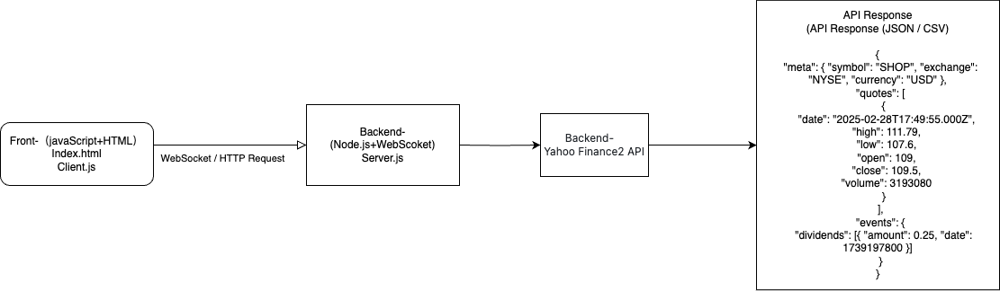
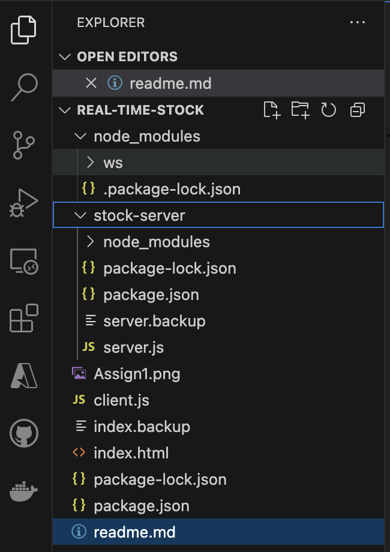

# Real-Time Stock Tracker

## Introduction
The **Real-Time Stock Tracker** is a web application that allows users to monitor stock prices in real time and visualize historical price data with candlestick charts. It was originally developed to demonstrate real-time data tracking using WebSockets and chart visualization.

With this tool, you can:
- Subscribe to live stock price updates
- View a list of subscribed stocks with their latest prices
- Display a stock’s price history in a **candlestick (K-line) chart**

The application fetches stock data from the **Yahoo Finance API** and provides an interactive front-end interface for ease of use.

---

## Features

### ✅ Real-Time Price Updates
- Subscribe to one or multiple stock symbols to fetch their **current market prices**.
- Uses **WebSocket connection** to retrieve the latest price for each subscribed stock.
- Prices update **dynamically** in a table without refreshing the page.
- Users can monitor multiple stocks simultaneously.

### 📊 Candlestick Chart Visualization
- View **historical price data** in a **K-line (candlestick) chart** format.
- Each candlestick represents **open, high, low, and close** prices over a time period (e.g., **daily for the past month**).
- Helps users **analyze trends and stock volatility**.

### 🔄 Subscription Management
- **Easily add or remove stocks** from tracking.
- Enter stock ticker symbols (e.g., `AAPL`, `TSLA`) and **click Subscribe**.
- Tracked stocks appear in a table with their **current price**.
- Click the **red "X" button** to remove stocks from tracking in real-time.

### ⚡ WebSocket-Based Backend
- Uses **WebSockets** to maintain an active connection with the client.
- Enables **instant price updates** without page refresh.
- Fetches stock prices via the **Yahoo Finance API** and pushes data to the front end.

### 📡 Yahoo Finance Integration
- Leverages **Yahoo Finance API (via yahoo-finance2)** for real-time **stock prices** and **historical candlestick data**.
- Ensures **accurate market data** is displayed.

---

## Technologies Used

| Technology | Description |
|------------|------------|
| **Node.js** | Backend framework to handle WebSocket connections and API requests |
| **WebSocket (ws)** | Handles real-time communication between client and server |
| **Yahoo Finance API** | Retrieves stock prices and historical data |
| **HTML/CSS/JavaScript** | Front-end implementation with UI for user interactions |
| **Chart.js** | Renders candlestick charts using historical stock data |

---

## Installation and Setup

### 1️⃣ Clone or Download the Project
```sh
$ git clone https://github.com/your-repo/real-time-stock-tracker.git
$ cd real-time-stock-tracker
```

### 2️⃣ Install Dependencies
Ensure **Node.js** is installed, then run:
```sh
$ npm install
```

### 3️⃣ Start the WebSocket Server
```sh
$ node server.js
```
- This launches the **Node.js server on port 8080**.
- The server listens for WebSocket connections and fetches stock data.

### 4️⃣ Open the Client Application
- Open `index.html` in a browser.
- You can also use **Live Server** (VS Code extension) to serve it at `http://127.0.0.1:5500/`.
- or
```sh
$ npx http-server
```

---

## Usage

### 📈 Subscribing to Stock Quotes
1. Enter the stock ticker symbol (e.g., `AAPL`, `TSLA`).
2. Click the **Subscribe** button.
3. The stock **appears in the table** with its latest price.
4. **Multiple stocks** can be tracked simultaneously.
5. Click the **red “X”** to remove a stock from tracking.

### 📉 Viewing Candlestick Charts
1. Click on a stock in the table or enter a symbol manually.
2. Click the **View K-line Chart** button.
3. A **candlestick chart** displays the stock’s **price history** for the past month.

### ❌ Removing Stocks
- Click the **red “X”** next to a stock to **stop tracking it**.
- The stock is **removed from the table** in real-time.

---

## Project Structure



### 📌 Front-End (Client)
- **index.html**: User interface with **input fields, buttons, stock table, and chart**.
- **client.js**:
  - Manages **WebSocket connections**.
  - Sends **subscribe requests** to the server.
  - Updates the **stock table dynamically**.
  - Renders **candlestick charts using Chart.js**.

### 🖥️ Back-End (Server)
- **server.js**:
  - Listens for **WebSocket connections** on `ws://localhost:8080`.
  - Handles **stock subscription requests**.
  - Fetches **real-time prices and historical data** from Yahoo Finance.
  - Sends data back to the client **instantly**.

---

## Example Workflow

1️⃣ **User opens the app** and enters a stock symbol (`AAPL`), clicks **Subscribe**. The **table updates** with Apple’s real-time price.

2️⃣ User enters another symbol (`TSLA`), clicks **Subscribe**. The table now shows both **AAPL** and **TSLA**.

3️⃣ User clicks **View K-line Chart** for `AAPL`. A **candlestick chart** appears, showing the past **one month’s** stock history.

4️⃣ User removes `TSLA` from tracking by clicking **red “X”**, and `TSLA` disappears from the table.

---

## Future Enhancements 🚀
- **Continuous real-time price updates** (via WebSocket push instead of polling).
- **Database integration** to store user subscriptions.
- **Extended historical data ranges** for candlestick charts.
- **User authentication** to save watchlists.

---

## Conclusion
The **Real-Time Stock Tracker** is a demonstration of **real-time WebSockets, financial data visualization, and interactive stock monitoring**. Users can subscribe to live prices, view **K-line charts**, and manage their watchlist seamlessly.

✅ **Real-time WebSocket updates**
✅ **Yahoo Finance integration**
✅ **Dynamic stock tracking UI**
✅ **Interactive candlestick charts**

This project can serve as a **foundation for building advanced stock tracking applications**.

---

## License
MIT License © 2025 Shaoxian Duan

---

## Contact
For any questions or improvements, feel free to reach out!

✉️ Email: `duan0027@algonquinlive.com`
🔗 GitHub: [My GitHub Profile](https://github.com/shaoxian423/real-time-stock)

